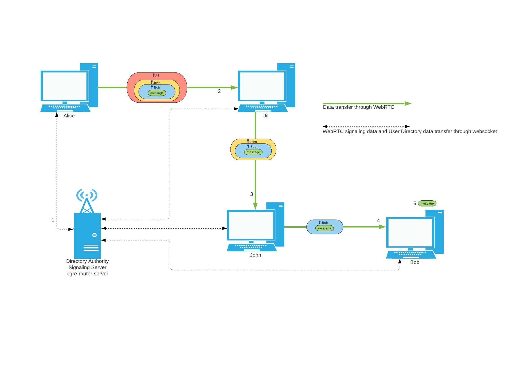

# Ogre Router

**CURRENTLY IN DEVELOPMENT**

This project hopes to create anonymous routing of data through the standard (chromium) browser.

It was inspired by Discord, Tor, [node-Tor](https://github.com/Ayms/node-Tor) among others. The routing mechanism is inspired by Tor's onion routing, but is not exactly the same (which is why the name was changed to ogre, though they both have layers).

## The Onion Router (TOR)

The onion router or TOR provides anonymous browsing to the web or onion sites.

Put simply it works by routing your traffic through different onion routers. Your traffic is encrypted in several layers and as it goes through each onion router they remove a layer of encryption.

You can read more about technical specifications on TOR online.

## How does this project implement something similar.

This project currently aims to anonymously transfer data through the web in a similar way.

Below is an example flow diagram of a message being sent from Alice to Bob with Jill and John also connected to the network.

1. Alice connects to the directory authority/signaling server.
   - This connection is established through websockets.
   - Connecting to the directory authority is neccessary as it lets you know who is currently connected to the network. This lets you know which nodes can be included in the circuit.
2. Alice creates a circuit of routes the message will travel between. Each route is a user on the network. Yes. This does mean someone connected to the network will be routing random user's messages.
   1. After creating a circuit Alice will create the layers of encryption around her message.
   2. After encrypting her message she will send it to the first user on her circuit.
3. When Jill gets a message she will decrypt a layer of the message. Then she will send it to the next user in the circuit, John.
4. When John gets the message he will do the same thing as Jill and send it to Bob
5. When Bob finally gets the message from John, he can decrypt it and find out the message Alice sent and that it came from alice.

This is the basic idea behind this project.

## Security

Coming Soon

## Usage

Coming Soon

## Frequently Asked Questions

Coming Soon